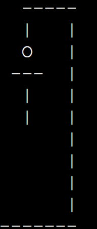

# Hangman Game

This is the story about the **Hangman Game.** This is a project written with Python codes aimed at getting players to guess correctly
a randomly selected word from a pool of lists containing the first twenty elements.

Link to the live project: [Hangman Game](https://hang-man-app-a6a9afadde6e.herokuapp.com/)

## Content
- [HOW TO PLAY](#how-to-play)
- [USER EXPERIENCE](#user-experience)
- [FEATURES](#features)
- [IMPORTED LIBRARIES](#imported-libraries)
- [TECHNOLOGIES USED](#technologies-used)
- [TESTING](#testing)
- [DEPLOYMENT](#deployment)
- [CREDITS](#credits)

## HOW TO PLAY
The hangman game is a game of guessing words between the computer and a player. 
The computer will select a random word from a pool of lists containing the first twenty elements and the player guesses letters to form the word selected.
The player has the chance for six(6) wrong guesses and after that will be signaled game over.
However, there is also a chance for the player to choose if he/she wants to play once more.

#### Play The Game
- When the game is started, a welcome message displays.
- Two lines of guides are also displayed to give you a clue on the kind of words you may be guessing.

#### Guessing A Word
- The hangman skeleton structure displays.
- This next line displays the word to guess.
- When you input the correct input you will be signaled CORRECT INPUT.
- The player will also be instructed to give letters in lowercase. 

#### How To Win 
- If the player guesses the correct word no full hangman will be drawn
- If the player is able to guess the word before the full hangman is drawn, he/she wins the game.

#### Game Over
- Every player has the chance to make 6 wrong guesses
- If a player cannot guess the correct letters for the selected element, the full hangman is drawn and you lose the game.

#### Replay
- After a win or a loss by a player, a message is displayed to play again or end the game.
- If you select Y, you play the game again, if you select N the game will end.

#### Additional Features
- If a player inputs one letter twice and it's not in the word like that, it will be ignored.
- If a player makes six incorrect guesses, the game is over.

## USER EXPERIENCE

#### User Goals
- Play a game of guesses with a computer.
- Get a clue of the kind of words to expect.
- See the list of letters he/she is guessing.
- Provide the correct inputs to avoid any error message.
- Win the game.
- Get the chance to play again after a win or loss.

#### Visual Design
- Green color for the welcome message
- Red color for blank input

## GAME FEATURES

### Welcome Page
- This page displays a hangman welcome message
- Displays a few lines of guide for the game
- The first word guess follows

Welcome page

### Word Generation
- A random word is selected from the first twenty elements list
- The element names will be displayed in lowercase

### Letter Guessing
- The player will input one letter at a time with validation to handle wrong inputs or characters.
- **Correct inputs** will display a collection of letters, and **wrong input** will add a part to the hangman drawing.

### Hangman Drawing
- A hangman drawing is fully done when a hangman player makes 6 wrong guesses while guessing a particular word in a hangman game.

### Win And Lose
- As a hangman player, you **Win** the game only when you have guessed a computer-selected word correctly.
- You **Lose** after 6 wrong guesses in attempt to guess a selected word correctly.
- You also have another chance to redeem yourself by having a replay of the game. 

### Colors For Feedback
**Green** is for the welcome message and valid inputs.

**Red** is for incorrect inputs.

### The Guide
- This part of the game basically outlines the kind of words to expect with examples.

### Error Handling
-This part deals with wrong inputs with messages telling you your mistake.

## IMPORTED LIBRARIES

### 1.Random
- This selects any of the first twenty elements randomly for guessing.

### 2.Colorama
- This gives a special color display to targeted print-out messages.

## TECHNOLOGIES USED

### Languages
- Python: This was used to develop the functionality of the hang-man-game

### Frameworks, Libraries and Programs
- GitHub- used to store and keep the project files.
- Gitpod- provides the workplace to develop the Python codes.
- [Chrome Lighthouse](https://developers.google.com/web/tools/lighthouse) - To test the website performance and accesibility.
- [Am I Responsive](https://ui.dev/amiresponsive) - To test responsivness.
- [PEP8 CI Python Linter](https://pep8ci.herokuapp.com/) - To validate my python code.
- [Heroku](https://dashboard.heroku.com/)- To use for the deployment of the project.
- Code institute workplace template.

## TESTING

### 1.Manual Testing

#### Welcome page
- **Test**: Loading of the welcome page
- **Expected Results**: A display of the welcome message, the guide, and the first selected word
- **Results**: Displays as expected.

#### Guessing a Letter
- **Test**: Input a valid letter(s,y,z)
- **Expected Results**: The selected letter will be displayed in a list of letters if found in the word, else will be prompted with a message.
- **Results**: Performs correctly as expected for correct and wrong inputs.

- **Test**: blank input or multiple letters(ab, hj, __)
- **Expected Results**: The inputs will rejected with a feedback message in color code.
- **Results**: Input will be rejected and signaled with the correct input type.

#### Winning and Lossing
- **Test**: a player guesses the correct word before exhausting all his chances. 
- **Expected Results**: a display message saying **Congrats You Did It**.
- **Results**: Works as expected.

- **Test**: when a player uses all his/her 6 chances to guess the selected word.
- **Expected Results**: a display message saying **Sorry You Lost!** followed with the correct word.
- **Results**: should work as expected, with a replay option at the end.

#### Replay functionality

- **Test**: prompt displays to replay again
- **Expected Results**: the game should restart all over again.
- **Results**: game welcome page loads with no errors.

**Test**: reject to replay
- **Expected Results**: display a Thank You message.
- **Results**: game is ended.

### 2. Validation

run.py

All clear, no errors found [CI Python Linter](https://pep8ci.herokuapp.com/).

**PEP8 Compliance**:
- Code was tested on PEP8 python linter to clarify all possible errors.
- Clearing of whitespaces after codes were done.
- Correct writing of docstrings.
- Reducing the length of line characters to the standard 79characters

### Checking on Browsers and Other Devices

- **Device check**: the game was tested on a laptop and a mobile phone and its use and functionality were ok.
- **Browser**: the game was tested on Chrome and Microsoft edge, funCtions and its display was ok.

## Deployment

### Steps for Heroku Deployment
1. Open a registered account with Heroku to obtain access to Heroku Dashboard
2. When access is granted, you go to [Heroku](https://dashboard.heroku.com/)
3. Create a new application from the dashboard.
4. Pick a project name, select your region, and click on Create App.
5. Go to settings
6. Input your Config Vars(Keys and Values), if needed
7. Select Heroku/Python first followed by Heroku/Nodejs under build packs settings 
8. Go to the deployment tab and under deployment method, select Github and click connect.
9. Make sure to connect to the correct repo name on Heroku.
10. Select either Automatic or Manual Deployment 
11. Go to view to see your live project deployed

### Forking Project On the GitHub Repository
The steps to fork the GitHub repository are:
1. Log into your [GitHub](https://github.com/).
2. Go to the repository https://github.com/maxwellsor169/Hang-man-game.
3. Click on the fork button on the top right-hand side of the screen.

### Making a Local Clone

-You log into your [GitHub](https://github.com/)
- Locate the repository https://github.com/maxwellsor169/Hang-man-game.
- Click on the code button 
- Copy the URL for the repository.
- Open the repository with a new terminal.
- Change the current directory to the location that you want the cloned directory to be.
- Type 'git clone' and paste the copied URL.
- Press 'enter' to create the clone.

## CREDITS

- Credit goes to:
1. Tutorial note by Real Python(https://realpython.com/python-hangman/#step-1-set-up-the-hangman-project)
2. Code Institute for the fundamental tutorials
3. Project sample by (https://github.com/Code-Institute-Submissions/hangman-game-pp3-4/blob/main/run.py)
4. My Mentor for always giving me the right information to do my projects.
5. Google search for my twenty-element list.